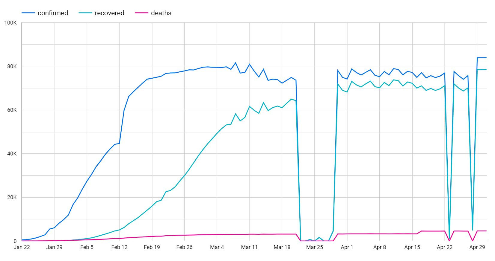
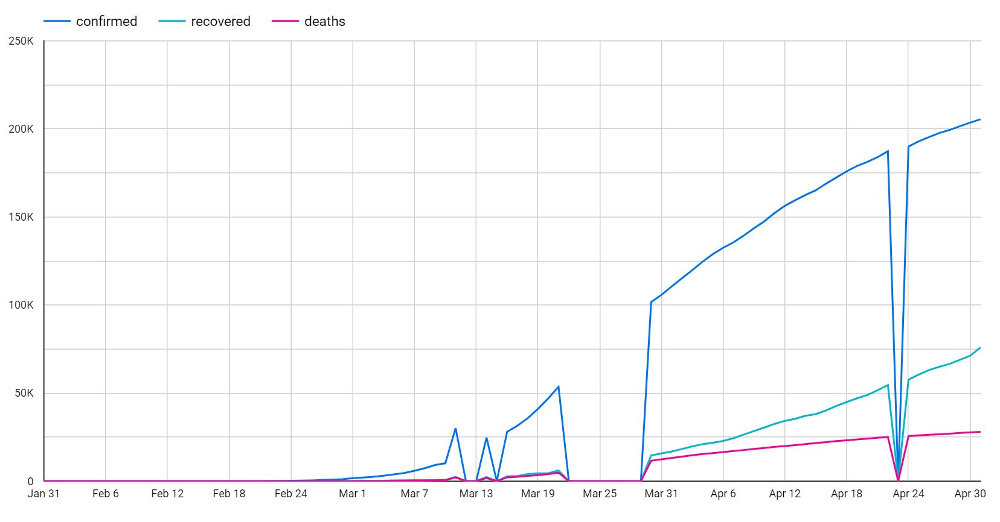
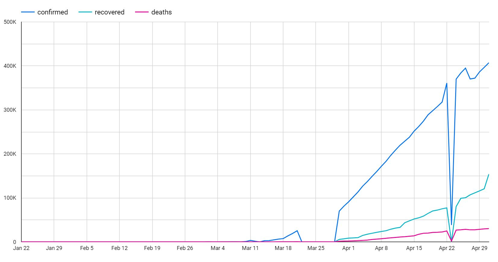

# COVID-19 Ingestion, Modeling, and Analysis
> Dana M. Brannon, The University of Texas at Austin

This repository shows the process of ingesting COVID-19 data from the [Johns Hopkins dataset](https://github.com/CSSEGISandData/COVID-19) into Google Cloud Platform's BigQuery, modeling the data, and finally performing an analysis on the data and generating a report.

This was an exercise we did in my Elements of Databases class, taught by Professor Shirley Cohen, who is a Solutions Architect at Google.

## Summary of the notebooks
<ol>
  <li><strong>Ingest</strong> the data
    <ol>
      <li>Download data from Johns Hopkins repo into a custom GCP bucket</li>
      <li>Create a BigQuery dataset and load the files into tables</li>
      <li>Inspect the data and merge the tables</li>
    </ol>
  </li>
  <li><strong>Model</strong> the data
    <ol>
      <li>Create a modeling dataset</li>
      <li>Implement a location based Primary Key</li>
      <li>Split the table into Location and Event tables</li>
      <li>Standardize Event table using SQL</li>
      <li>Standardize Location table using Beam</li>
    </ol>
  </li>
  <li><strong>Analyze</strong> the data
    <ol>
      <li>Explore the modeled tables</li>
      <li>Create views for the data we want to visualize</li>
      <li>Access those views inside Data Studio to create some cool charts!</li>
    </ol>
  </li>
 </ol>

## Using these notebooks
If you would like to perform your own analysis, feel free to clone this repository. First, you must have access to the Google Cloud Platform console. You also need to create a bucket in GCP's Storage Browser (mine is called `covid-19-johnshopkins`, which you can change to match your custom bucket name in the Ingestion notebook.)

You should be comfortable with SQL as well as Apache Beam in order to use these notebooks. After modeling the data in appropriate tables, you can then use GCP's Data Studio to create custom visualizations and reports.

Happy coding!

## Data Studio Visual Report
Here are the results of the analysis, charted using GCP's Data Studio. You can see in late March and parts of April that there are portions of the data missing. I wanted to represent the original data as-is, but it may make sense in some scenarios to fill in that missing data with an average of the points closest to it so that readers are less likely to be confused or misinterpret the data. Data manipulation like this is entirely based on the specific situation of data representation.

### China Data

### Italy Data

### US Data

## Setting up Beam and Dataflow within GCP
Here are the [steps](https://github.com/cs327e-spring2020/snippets/wiki/Beam--&-Dataflow-Setup) on getting your Cloud Platform environment set up with Apache Beam and Dataflow.
